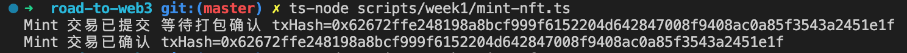
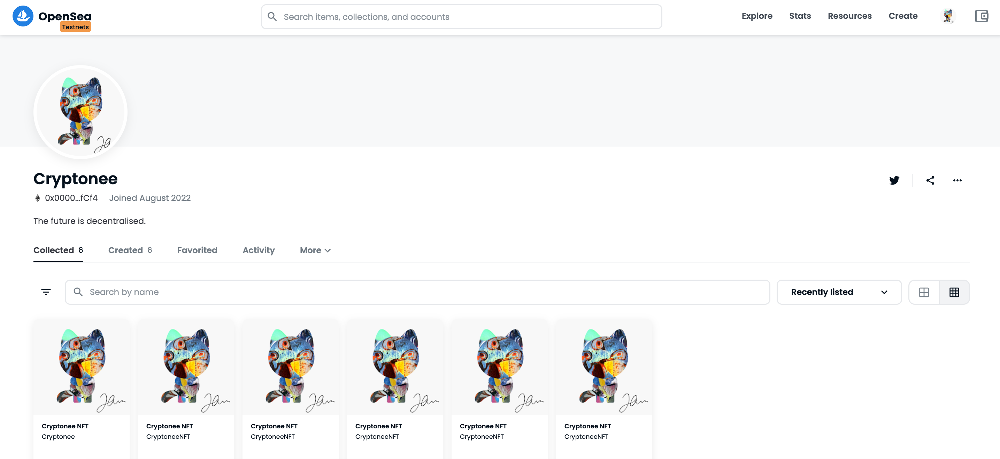

# Week 1 - 如何开发一个 ERC721 标准的 NFT 合约？

教程原文：[https://docs.alchemy.com/docs/how-to-develop-an-nft-smart-contract-erc721-with-alchemy](https://docs.alchemy.com/docs/how-to-develop-an-nft-smart-contract-erc721-with-alchemy)

水龙头（领取测试网的测试币）：[Rinkeby Faucet](https://rinkebyfaucet.com)

合约：[CryptoneeNFT.sol](../contracts/week1/CryptoneeNFT.sol)

脚本：[mint-nft.ts](../scripts/week1/mint-nft.ts)

## 操作步骤

### 1. 部署合约

```sh
# 在 Rinkeby 网络部署合约
npx hardhat run --network rinkeby scripts/week1/deploy.ts
```

合约地址：[0x9b1c0175860b8f6bd77d49037bb1449ebf0196cd](https://rinkeby.etherscan.io/address/0x9b1c0175860b8f6bd77d49037bb1449ebf0196cd)

### 2. Mint 一个 NFT

```sh
ts-node scripts/week1/mint-nft.ts
```



### 3. 在 OpenSea 查看 Mint 的 NFT

[https://testnets.opensea.io/Cryptonee](https://testnets.opensea.io/Cryptonee)

