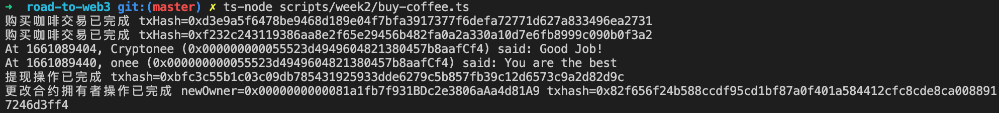
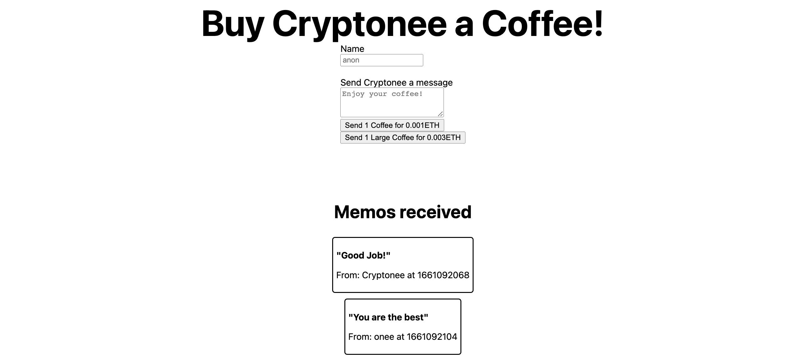

# Week 2 - 如何构建一个 “给我买杯咖啡” 的 DApp？

教程原文：[https://docs.alchemy.com/docs/how-to-build-buy-me-a-coffee-defi-dapp](https://docs.alchemy.com/docs/how-to-build-buy-me-a-coffee-defi-dapp)

水龙头（领取测试网的测试币）：[Goerli Faucet](https://goerlifaucet.com)

合约：[BuyMeACoffee.sol](../contracts/week2/BuyMeACoffee.sol)

脚本：[buy-coffee.ts](../scripts/week2/buy-coffee.ts)

## 操作步骤

### 1. 部署合约

```sh
# 在 Goerli 网络部署合约
npx hardhat run --network goerli scripts/week2/deploy.ts
```

合约地址：[0x4cb99f420c2bcd9508eb65efed4c4f59f20712ee](https://goerli.etherscan.io/address/0x4cb99f420c2bcd9508eb65efed4c4f59f20712ee)

### 2. 执行购买、查看、提现操作

```sh
ts-node scripts/week2/buy-coffee.ts
```



### 3. 构建 DApp 完成操作

- [https://buymeacoffee-solidity-defi-tipping-app.onee-io.repl.co/](https://buymeacoffee-solidity-defi-tipping-app.onee-io.repl.co/)

