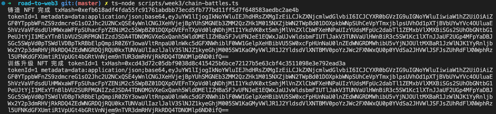
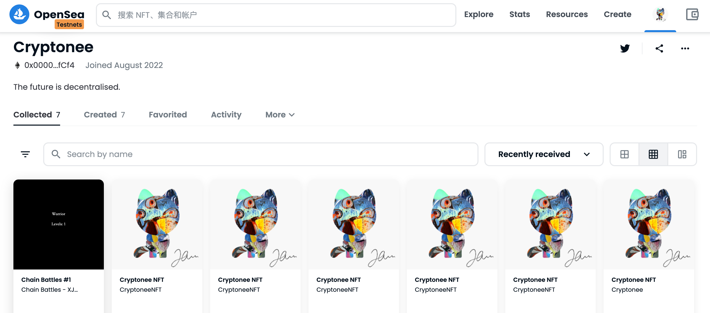

# Week 3 - 如何使用链上数据制作 NFT？

教程原文：[https://docs.alchemy.com/docs/how-to-make-nfts-with-on-chain-metadata-hardhat-and-javascript](https://docs.alchemy.com/docs/how-to-make-nfts-with-on-chain-metadata-hardhat-and-javascript)

水龙头（领取测试网的测试币）：[Mumbai Faucet](https://mumbaifaucet.com)

合约：[ChainBattles.sol](../contracts/week3/ChainBattles.sol)

脚本：[chain-battles.ts](../scripts/week3/chain-battles.ts)
## 操作步骤

### 1. 部署合约

```sh
# 在 Mumbai 网络部署合约
npx hardhat run --network mumbai scripts/week3/deploy.ts
```

合约地址：[0xf82932c1c3aed99b1934d094bb0b8041526b139b](https://mumbai.polygonscan.com/address/0xf82932c1c3aed99b1934d094bb0b8041526b139b)

### 2. 执行铸造、查看、训练操作

```sh
ts-node scripts/week3/chain-battles.ts
```



### 3. 在 OpenSea 查看 Mint 的 NFT

[https://testnets.opensea.io/Cryptonee](https://testnets.opensea.io/Cryptonee)

